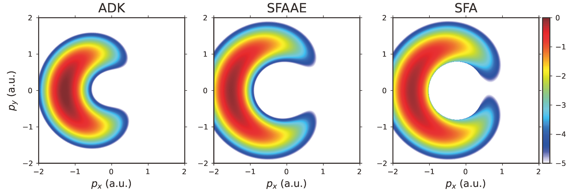

# Example: Attoclock and Initial Condition Methods

With the aim of studying the influence of non-adiabatic effects on the attoclock signal, we employ ADK, SFA-AE and SFA to provide the initial conditions of the electrons, and perform trajectory simulations.

The simulation parameters are taken from Ma *et al.* [*J. Phys. B* **54**, 144001 (2021)] [^Ma_2021]

[^Ma_2021]: Y. Ma *et al.*, Influence of Nonadiabatic, Nondipole and Quantum Effects on the Attoclock Signal. *J. Phys. B: At. Mol. Opt. Phys.* **54**, 144001 (2021). DOI: [10.1088/1361-6455/ac0d3e](https://dx.doi.org/10.1088/1361-6455/ac0d3e)

```julia
@info "SemiclassicalSFI Example - Attoclock"

@info "Loading Packages..."
using SemiclassicalSFI
using SemiclassicalSFI.Targets
using SemiclassicalSFI.Lasers

t = HeAtom()
l = Cos4Laser(peak_int=4e14, wave_len=800, cyc_num=2, ellip=1.0)

init_cond_list = [:ADK, :SFAAE, :SFA]

for init_cond in init_cond_list
    @info "Running $(init_cond)..."
    filename = "SCSFI_He_4e14_800nm_2cyc_CP_$(init_cond)_CTMC.h5"
    performSFI(
        target = t,
        laser = l,
        init_cond_method = init_cond,
        sample_t_intv = (-80,80),
        sample_t_num = 20000,
        ss_kd_max = 1.5,
        ss_kd_num = 1000,
        ss_kz_max = 1.5,
        ss_kz_num = 50,
        traj_phase_method = :CTMC,
        traj_t_final = 120,
        final_p_max = (2,2,2),
        final_p_num = (500,500,1),
        save_path = filename
    )
end
```

Below shows the momentum spectrum squashed on the polarization plane.


