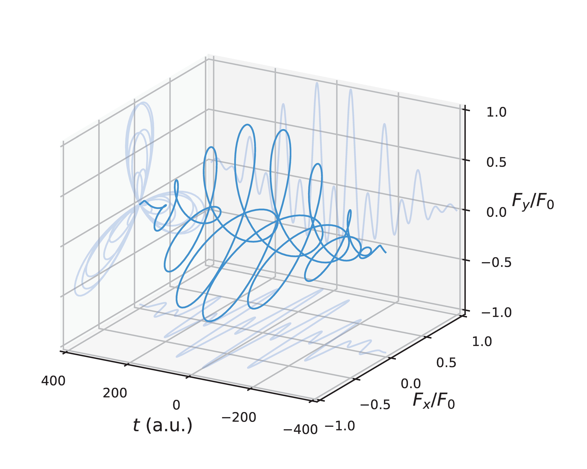

# Example: Bichromatic ω-2ω Pulses

A bichromatic laser which consists of a fundamental and its second harmonic frequency component, is widely used to construct a variety of specific tailored waveforms for manipulation and exploration of the ultrafast dynamics of light-matter interactions.

In this example, we use a bichromatic laser pulse which combines two counter-rotating circularly-polarized laser pulses of 800 nm and 400 nm wavelengths.
By adjusting the relative intensity of the two frequency components, the waveform of the pulse can be tailored to exhibit a clover-like shape, which facilitates control of the emission direction of the ejected electrons. The PMD for different laser intensities is shown in the figure below.

```julia
# examples/test_Bichromatic_CCP.jl

using eTraj
using eTraj.Targets, eTraj.Lasers, eTraj.Units

for int in [1e14, 3e14, 5e14, 7e14]
    @info "Running I0=$(int) W/cm^2"
    l1 = Cos2Laser(peak_int=int*W/cm^2, wave_len=800.0nm, cyc_num=8,  ellip= 1.0)
    l2 = Cos2Laser(peak_int=int*W/cm^2, wave_len=400.0nm, cyc_num=16, ellip=-1.0)
    l = BichromaticLaser(l1=l1, l2=l2)
    t = get_atom("H")
    perform_traj_simulation(
        init_cond_method    = :ADK,
        rate_prefix         = Set([:Pre,:Jac]),
        traj_phase_method   = :SCTS,
        laser               = l,
        target              = t,
        dimension           = 2,
        sample_t_intv       = (-350,350),
        sample_t_num        = 10000,
        traj_t_final        = 450,
        final_p_max         = (2.5,2.5),
        final_p_num         = (500,500),
        ss_kd_max           = 1.0,
        ss_kd_num           = 5000,
        output_path         = "ADK-SCTS_Bichromatic_$(int)_800+400nm_8+16cycs_CounterCP.jld2"
    )
end
```




